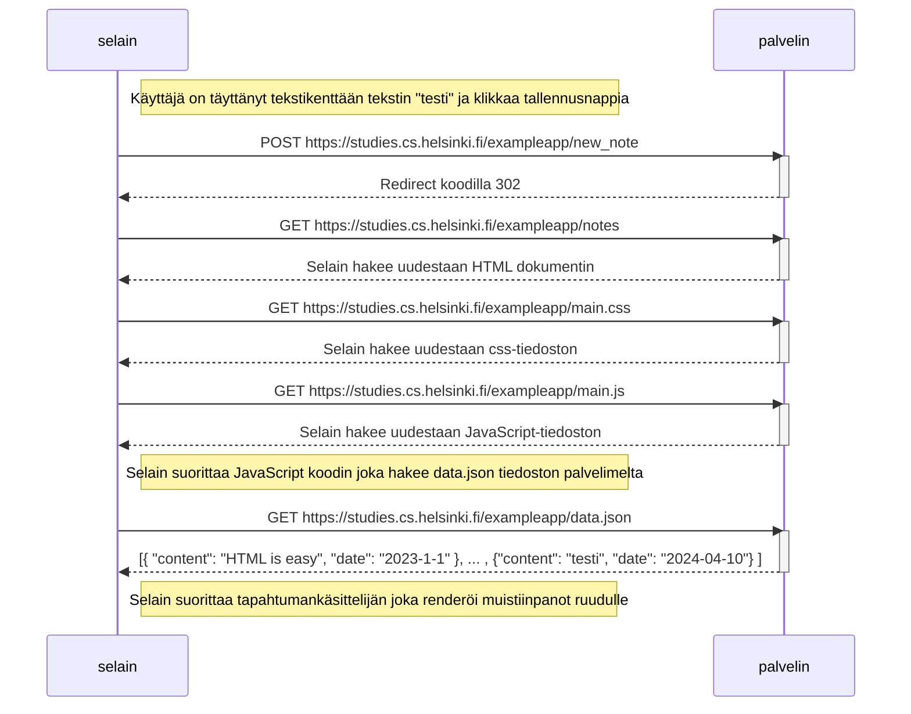

```mermaid
sequenceDiagram
    participant selain
    participant palvelin
    
    Note right of selain: Käyttäjä on täyttänyt tekstikenttään tekstin "testi" ja klikkaa tallennusnappia

    selain->>palvelin: POST https://studies.cs.helsinki.fi/exampleapp/new_note
    activate palvelin
    palvelin-->>selain: Redirect koodilla 302
    deactivate palvelin
    
    selain->>palvelin: GET https://studies.cs.helsinki.fi/exampleapp/notes
    activate palvelin
    palvelin-->>selain: Selain hakee uudestaan HTML dokumentin
    deactivate palvelin
    
    selain->>palvelin: GET https://studies.cs.helsinki.fi/exampleapp/main.css
    activate palvelin
    palvelin-->>selain: Selain hakee uudestaan css-tiedoston
    deactivate palvelin
    
    selain->>palvelin: GET https://studies.cs.helsinki.fi/exampleapp/main.js
    activate palvelin
    palvelin-->>selain: Selain hakee uudestaan JavaScript-tiedoston
    deactivate palvelin
    
    Note right of selain: Selain suorittaa JavaScript koodin joka hakee data.json tiedoston palvelimelta
    
    selain->>palvelin: GET https://studies.cs.helsinki.fi/exampleapp/data.json
    activate palvelin
    palvelin-->>selain: [{ "content": "HTML is easy", "date": "2023-1-1" }, ... , {"content": "testi", "date": "2024-04-10"} ]
    deactivate palvelin    

    Note right of selain: Selain suorittaa tapahtumankäsittelijän joka renderöi muistiinpanot ruudulle
```