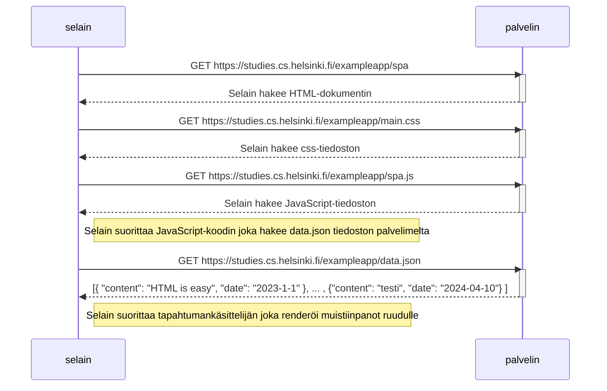

```mermaid
sequenceDiagram
    participant selain
    participant palvelin

    selain->>palvelin: GET https://studies.cs.helsinki.fi/exampleapp/spa
    activate palvelin
    palvelin-->>selain: Selain hakee HTML-dokumentin
    deactivate palvelin

    
    selain->>palvelin: GET https://studies.cs.helsinki.fi/exampleapp/main.css
    activate palvelin
    palvelin-->>selain: Selain hakee css-tiedoston
    deactivate palvelin
    
    selain->>palvelin: GET https://studies.cs.helsinki.fi/exampleapp/spa.js
    activate palvelin
    palvelin-->>selain: Selain hakee JavaScript-tiedoston
    deactivate palvelin
    
    Note right of selain: Selain suorittaa JavaScript-koodin joka hakee data.json tiedoston palvelimelta
    
    selain->>palvelin: GET https://studies.cs.helsinki.fi/exampleapp/data.json
    activate palvelin
    palvelin-->>selain: [{ "content": "HTML is easy", "date": "2023-1-1" }, ... , {"content": "testi", "date": "2024-04-10"} ]
    deactivate palvelin    

    Note right of selain: Selain suorittaa tapahtumankäsittelijän joka renderöi muistiinpanot ruudulle
```