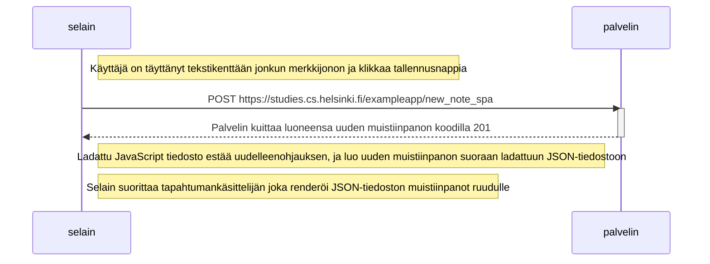

[Apuna käytetty kurssisivulla ollutta kaaviota]::

```mermaid
sequenceDiagram
    participant selain
    participant palvelin

    Note right of selain: Käyttäjä on täyttänyt tekstikenttään jonkun merkkijonon ja klikkaa tallennusnappia

    selain->>palvelin: POST https://studies.cs.helsinki.fi/exampleapp/new_note_spa
    activate palvelin
    palvelin-->>selain: Palvelin kuittaa luoneensa uuden muistiinpanon koodilla 201
    deactivate palvelin

    Note right of selain: Ladattu JavaScript tiedosto estää uudelleenohjauksen, ja luo uuden muistiinpanon suoraan ladattuun JSON-tiedostoon

    Note right of selain: Selain suorittaa tapahtumankäsittelijän joka renderöi JSON-tiedoston muistiinpanot ruudulle
```